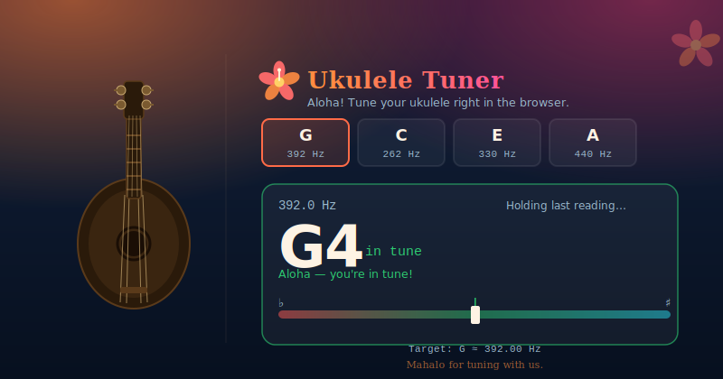

# Ukulele Tuner

A free, browser-based ukulele tuner. No app download, no plugin, no account — just open the page, allow microphone access, and start tuning.

**[Live demo →](https://acseguin21.github.io/ukulele-tuner)**



---

## Features

- **Standard & Low G tuning** — supports both high G (G4 C4 E4 A4) and low G (G3 C4 E4 A4 / baritone / linear) tunings
- **Hold-on-silence** — the reading stays frozen for ~3 seconds after the string stops ringing so you can adjust the peg without re-plucking
- **Cent-accurate meter** — autocorrelation pitch detection with parabolic interpolation for sub-sample accuracy
- **Plain-text guidance** — tells you exactly which direction to turn the peg and by roughly how many cents
- **No dependencies** — vanilla HTML, CSS, and JavaScript (ES modules); zero build step required

## How to use

1. Open the [live demo](https://acseguin21.github.io/ukulele-tuner) (or run it locally — see below).
2. Click **Start microphone** and choose **Allow** when your browser asks for permission.
3. Select the string you are tuning: **G**, **C**, **E**, or **A**.
4. Pluck that string once and let it ring. The reading stays on screen for a few seconds after the sound fades.
5. Follow the direction text under the meter — it tells you whether to tighten or loosen, and by roughly how much.

## Running locally

The Web Audio API requires a secure context (`https://` or `localhost`). Opening `index.html` directly as a `file://` URL will block microphone access in most browsers.

**Option 1 — Python (no install needed on macOS/Linux):**

```bash
cd ~/path/to/ukulele-tuner
python3 -m http.server 8765
# then open http://localhost:8765
```

**Option 2 — Node.js:**

```bash
npx serve .
# then open the URL shown in the terminal
```

**Option 3 — VS Code:** install the [Live Server](https://marketplace.visualstudio.com/items?itemName=ritwickdey.LiveServer) extension and click **Go Live**.

## How it works

Audio is captured via `getUserMedia` and fed into a Web Audio `AnalyserNode` configured with a 4096-sample FFT window. Each animation frame the raw PCM buffer is analysed using a time-domain autocorrelation algorithm:

1. Compute RMS — ignore frames below a noise floor (`rms < 0.01`).
2. Search for the lag (period) with the highest correlation in the range 70–1200 Hz.
3. Refine the lag to sub-sample resolution using parabolic interpolation.
4. Convert the refined period → Hz → MIDI note → note name + cents from the selected target.

After the signal drops the last detected pitch is held for 3.2 seconds so you can read the result while adjusting the peg.

## License

MIT — see [LICENSE](LICENSE).
